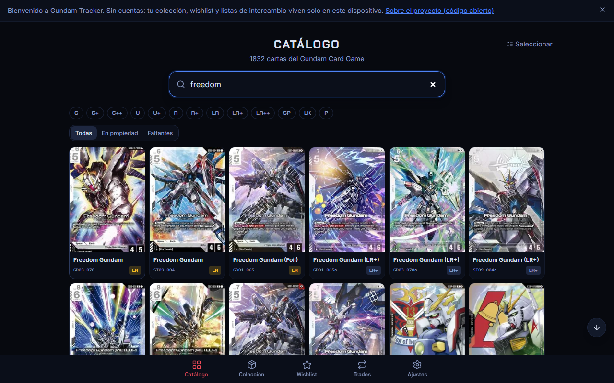
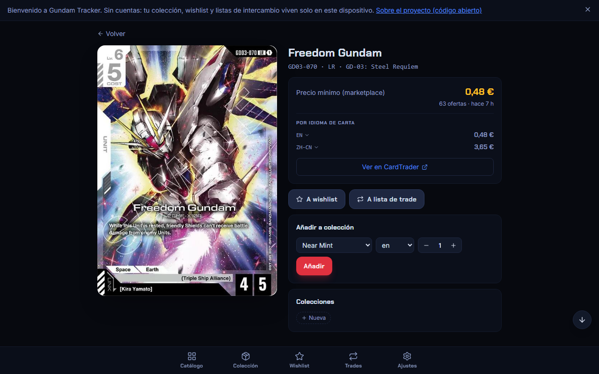
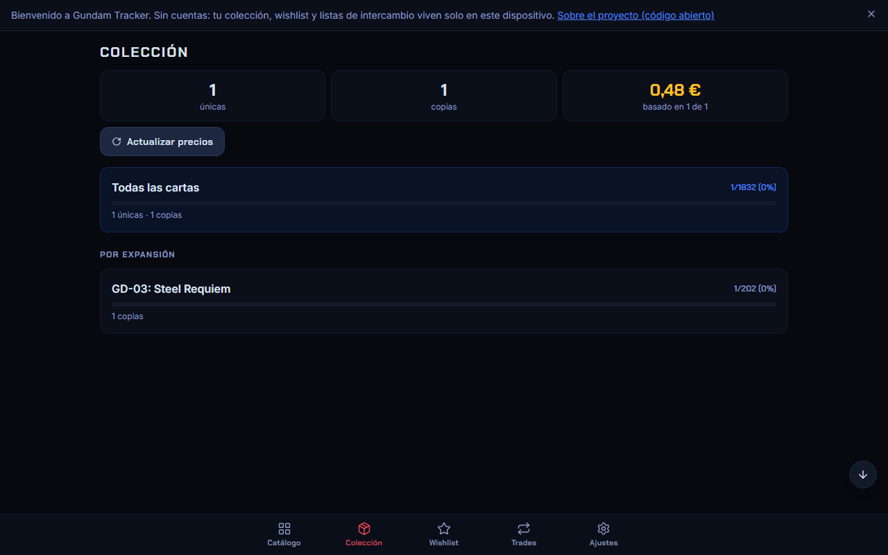

# Gundam Tracker

**[gundam.poordevelopers.com](https://gundam.poordevelopers.com)** — gestiona tu colección del [Gundam Card Game](https://www.gundam-gcg.com/): catálogo completo, colección valorada, wishlist y listas de intercambio compartibles. Sin cuentas, sin servidor propio, sin publicidad. Todo vive en tu dispositivo.

[](https://github.com/cdelgado813/gundam-tracker/actions/workflows/deploy.yml)
[](LICENSE)

<p align="center">
  
  
  
</p>

## Qué es

Una PWA instalable para llevar el control de tu colección física del Gundam Card Game:

- **Catálogo completo** de todas las expansiones, con búsqueda instantánea y filtro por rareza y por propiedad.
- **Colección valorada**: cantidad, condición e idioma por copia, con precios reales de mercado desglosados por idioma de carta (en/jp/zh-CN).
- **Wishlist** y **listas de intercambio** con nombre y tope de 100 unidades, compartibles por enlace, QR o fichero — sin servidor propio, sin cuentas en ningún lado.
- **Colecciones personalizadas** (mazos, favoritas...) independientes del catálogo.
- **Copias de seguridad automáticas** y exportación/importación manual.
- Interfaz en **español, inglés y catalán**.
- **PWA instalable** con actualización automática en segundo plano.

No hay cuentas de usuario, no hay backend que mantenga datos personales, y no hay nada de pago dentro de la app.

## Stack técnico

- [React 19](https://react.dev/) + [TypeScript](https://www.typescriptlang.org/) + [Vite](https://vite.dev/)
- [Tailwind CSS v4](https://tailwindcss.com/) con tokens de diseño propios (paleta "mecha": hangar/zeon/federation/newtype/haro)
- [Dexie](https://dexie.org/) (IndexedDB) para todos los datos del usuario — colección, wishlist, trade lists, backups
- [Zustand](https://zustand-demo.pmnd.rs/) para estado de UI persistido (idioma, modo de vista...)
- [react-router-dom](https://reactrouter.com/) con `HashRouter` (sitio 100% estático, sin servidor que resuelva rutas)
- [fflate](https://github.com/101arrowz/fflate) para comprimir listas compartidas en la URL, [qrcode](https://github.com/soldair/node-qrcode) para generarlas como QR
- [vite-plugin-pwa](https://vite-pwa-org.netlify.app/) para el service worker y el manifest

## Arquitectura: sin backend

Gundam Tracker no tiene servidor propio. Dos piezas:

1. **La app** (`webapp/`): un sitio estático desplegado en GitHub Pages. Todos los datos del usuario (colección, wishlist, trades) viven en IndexedDB, en su propio dispositivo.
2. **El catálogo y los precios** (`scripts/sync-catalog.mjs`): un script de Node que corre en CI ([`.github/workflows/sync-catalog.yml`](.github/workflows/sync-catalog.yml)) una vez al día, sincroniza desde la API de [CardTrader](https://www.cardtrader.com/) con el token del propietario del proyecto (nunca expuesto al navegador) y publica el resultado como JSON estático en `webapp/public/data/`. La app solo lee esos ficheros — no se autentica contra CardTrader ni hace ninguna llamada que dependa de una cuenta.

```
CardTrader API ──(CI diario, con token)──▶ webapp/public/data/*.json ──▶ app estática (GitHub Pages)
```

## Correr en local

No hace falta ninguna credencial: el catálogo ya está sincronizado como JSON estático dentro del repositorio.

```bash
cd webapp
npm install
npm run dev
```

Otros comandos útiles dentro de `webapp/`:

```bash
npm run build     # tsc -b && vite build
npm run preview   # sirve el build de producción en local
npm run lint      # oxlint
```

Si quieres correr tú mismo la sincronización del catálogo (`scripts/sync-catalog.mjs`), necesitas un `CARDTRADER_JWT` propio:

```bash
CARDTRADER_JWT=tu_token node scripts/sync-catalog.mjs
```

## Cómo se construyó

Todo el desarrollo de este proyecto sigue [OpenSpec](https://github.com/Fission-AI/OpenSpec): cada cambio se propone (`proposal.md`), se diseña (`design.md`), se especifica en requisitos verificables (`specs/**/*.md`) y se desglosa en tareas (`tasks.md`) *antes* de escribir código, y queda archivado como historial una vez implementado y desplegado.

- [`openspec/specs/`](openspec/specs/) es la fuente de verdad de lo que la app hace hoy, capacidad por capacidad (catálogo, colección, wishlist, trade lists, i18n, navegación, backup...).
- [`openspec/changes/archive/`](openspec/changes/archive/) es el historial completo de cómo se llegó hasta aquí: por qué se tomó cada decisión, qué alternativas se descartaron y por qué.

## Créditos

Datos de cartas y precios de [CardTrader](https://www.cardtrader.com). Gundam Tracker es un proyecto independiente de un fan, no afiliado a Bandai Namco, Sunrise ni CardTrader. Es parte de [poordevelopers](https://poordevelopers.com), un colectivo que construye herramientas simples, gratuitas y sin ánimo de lucro.

Si te resulta útil, puedes [invitarme a un café](https://www.buymeacoffee.com/JapaneseWeddingPhotos) — totalmente opcional, la app entera funciona igual sin ello.

## Licencia

[MIT](LICENSE)
